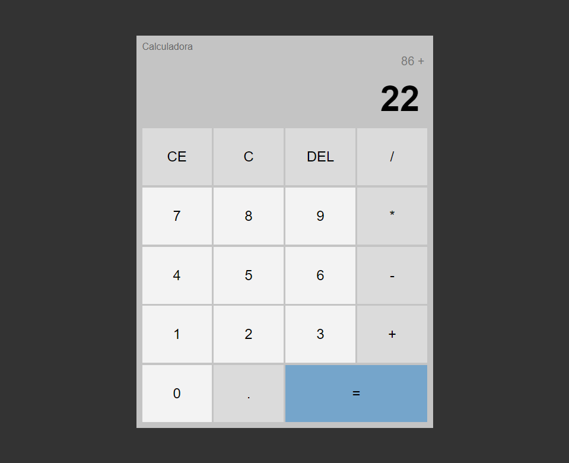

# :fax: Calculadora Básica em Javascript
>## :page_with_curl: Resumo

Este projeto de calculadora, feita em Javascript, foi desenvolvida com o auxílio do projeto de [Matheus Battisti](https://www.youtube.com/watch?v=KCfaPZ2t2yA&list=PLnDvRpP8BneysKU8KivhnrVaKpILD3gZ6&index=59), compõe apenas 4 operações básicas (+, -, /, *), e tem o intuito de exercitar os conceitos de POO, arrays e lógica de programação.

:link: [Clique aqui para acessar!](https://isabelafs1003.github.io/basic-calculator-javascript/)

>## :wrench: Tecnologias
 - HTML
 - CSS
 - JS

>## :books: Conhecimentos
- Lógica de Programação
- Conceitos Básicos em POO